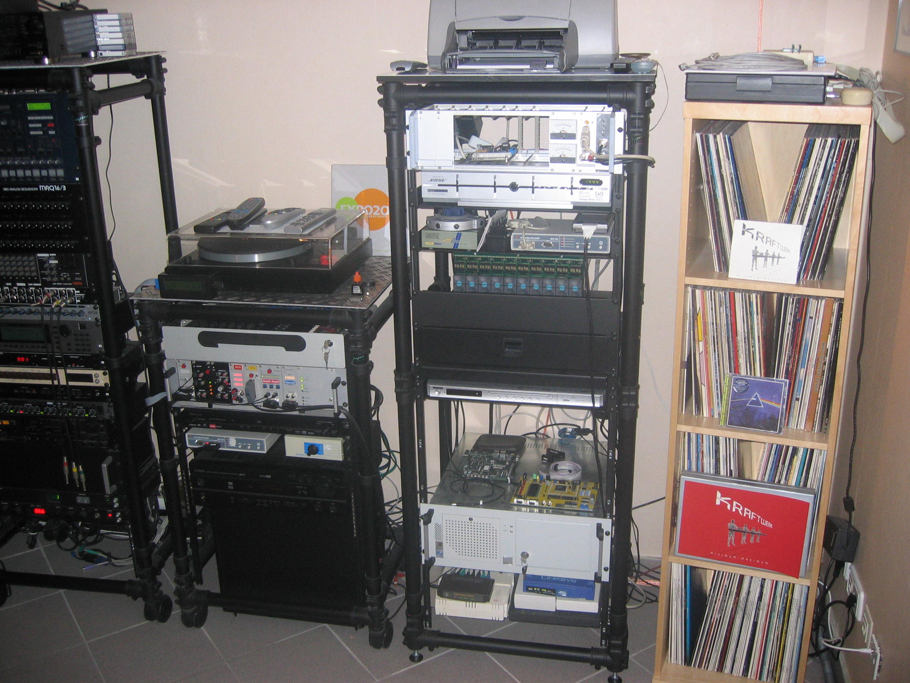

# Welcome to RealTimeAudioLab

## These photographs offer a glimpse into the RTAL Studio as it appeared in 2009. Many of the engineering projects documented in the repositories below were developed, tested and used in this studio, where they formed part of the daily production environment.

  

  

